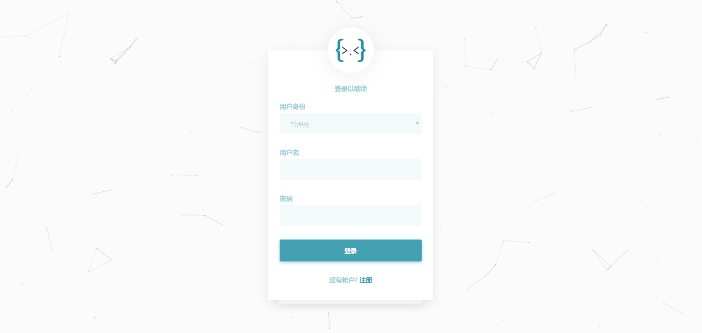
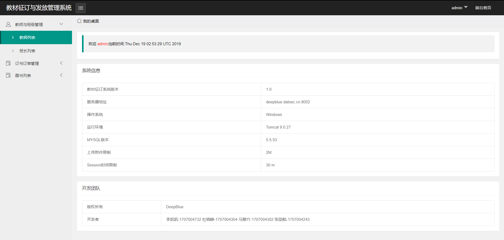
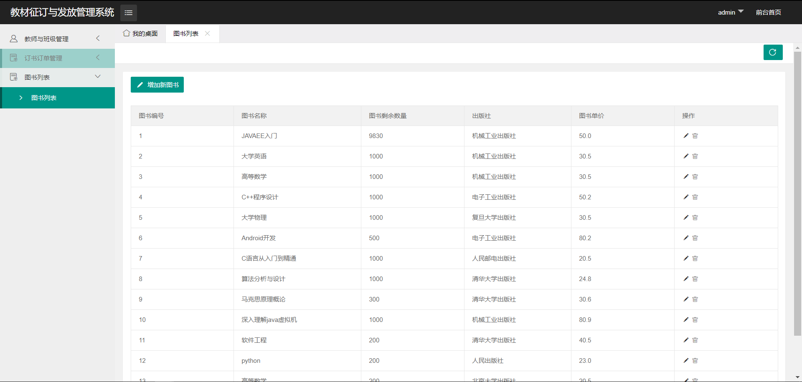

# 软件工程作业：教材征订与发放管理系统

## 版权所有-中北大学，17070143班，转载请注明出处!
软件开发环境:  ```IDEA```  
软件运行环境:  ```Tomcat```  
开发语言及框架: ```Java-SSM```  

- How To Use?  
  ```Soe/target/deep.war```这个war包放到Tomcat的WebApps目录下，启动服务,访问:http://127.0.0.1:8080/deep/login 即可。

- 软件效果?  
  可以登陆这个网站看一看,请大哥们手下留情。    
  http://deepblue.datsec.cn:8002/se/login  

  


### 实现的功能:  
```管理员```  
查看所有图书  
修改图书库存  
审批图书订单(通过图书订单,不通过订单)  
删除图书订单  
查看等待发放的图书  
查看已经发放的图书  
增加库存图书  
删除库存图书  
修改图书数量  
教师与班级管理  
查看教师列表  
查看班长列表  
修改教师信息  
修改班长信息  
修改班长密码  
修改教师密码  
删除教师  
删除班长  
发放图书  
修改教师信息  
修改学生信息  
查看已经发放订单  
  
```老师```  
查看自己订单  
查看图书信息  
增加订单  
查看发放订单  
修改个人信息  
修改学生  
查看班长列表  
修改班长信息  
  
```班长```  
修改个人信息  
查看自己班已经审批订单  
